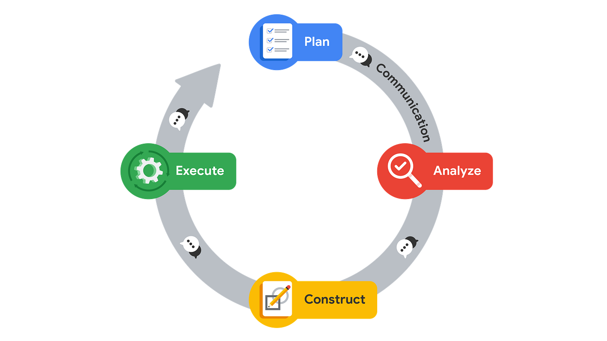
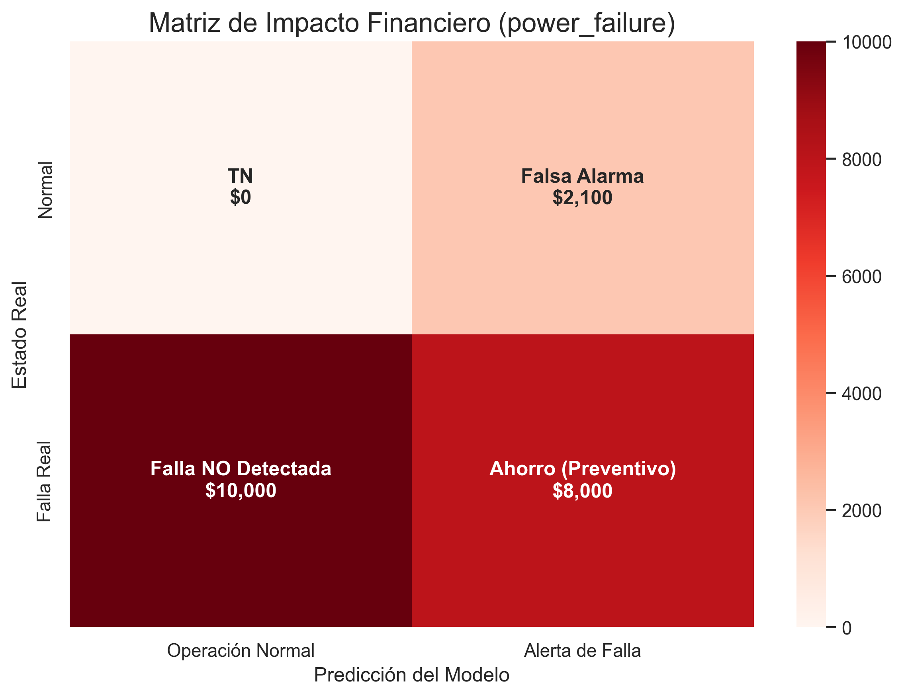
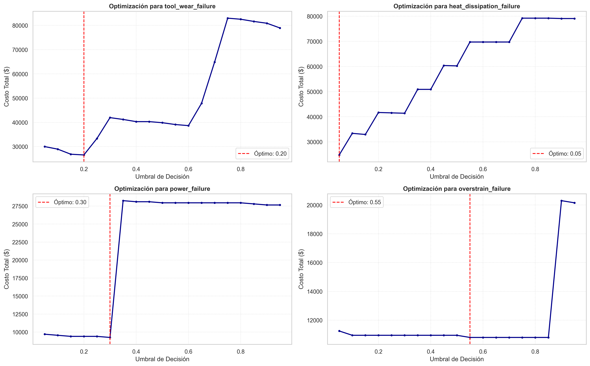
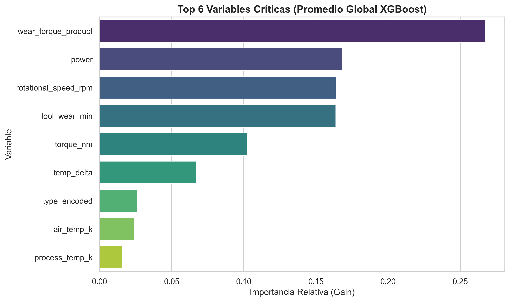
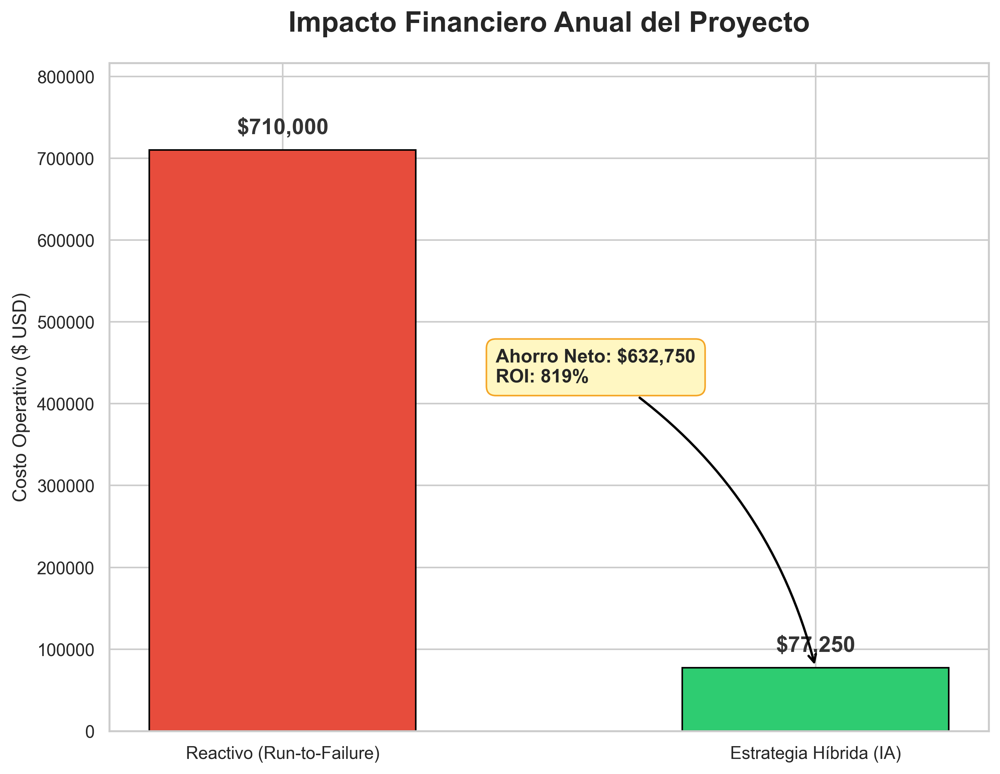

# Optimización de Mantenimiento Predictivo Industrial: Un Enfoque Basado en Costos con XGBoost


## 📋 Resumen Ejecutivo

**El Desafío:** La ineficiencia y el alto costo de las fallas no planificadas en equipos rotativos industriales representan pérdidas críticas. En este caso de estudio, una falla no planificada conlleva un costo de **$10,000 USD**, mientras que una intervención preventiva cuesta solo **$500 USD**. El objetivo no es solo predecir fallas, sino minimizar el costo operativo total.

**La Solución:** Se desarrolló un sistema predictivo híbrido ("Condition-Based Maintenance"). Para las fallas por desgaste lineal, se validó una regla determinista (Mantenimiento preventivo); para fallas estocásticas complejas (Potencia, Calor), se implementaron modelos de **XGBoost** calibrados con matrices de costo personalizadas y ajuste de umbrales de probabilidad.

**El Resultado:** La implementación de la estrategia híbrida (Regla Fija + IA) proyecta un **Ahorro Total Estimado de $638,300.00** en comparación con la estrategia reactiva ("Run-to-Failure"), logrando un ROI del **890.2%**.

**Tecnologías Clave:** Python, Pandas, XGBoost, Scikit-Learn, Matplotlib/Seaborn.

---

## 💼 Caso de Negocio y Metodología (PACE)

Este proyecto sigue el flujo de trabajo PACE (Plan, Analyze, Construct, Execute) para garantizar la alineación entre la técnica y el negocio.


*(Nota: Diagrama del flujo de datos y decisiones)*

### 1. Plan (Definición Estratégica)
* Definición de KPIs financieros: Costo de Falso Negativo (Rotura) vs. Falso Positivo (Inspección). Ahorro por aplicar el modelo y Retorno de Inversion (ROI).
* Establecimiento del objetivo: Maximizar el **Recall** en fallas críticas y la **Precisión** en fallas leves.

### 2. Analyze (Exploración de Datos)
* Análisis de física de sensores: Correlación entre Torque, RPM y Temperatura.
* Detección de desbalance severo de clases (<4% de fallas).
* Identificación de patrones lineales en la falla por desgaste de herramienta (*Tool Wear Failure*).

### 3. Construct (Modelado)
* Entrenamiento comparativo: **Random Forest** (interpretabilidad) vs. **XGBoost** (rendimiento).
* Gestión de desbalance: Uso del hiperparámetro `scale_pos_weight` calculado dinámicamente.
* Ingeniería de características e importancia de variables (Gain).

### 4. Execute (Estrategia de Despliegue)
* **Calibración del Punto de Operación:** Búsqueda del umbral de probabilidad óptimo que minimiza la curva de costos para cada tipo de falla.
* **Diseño de Estrategia Híbrida:**
    * *Desgaste (TWF):* Mantenimiento Preventivo (>200 min).
    * *Potencia/Calor (PWF/HDF):* Mantenimiento Predictivo mediante IA.

---

## 📊 Visualización de Resultados Clave

### 1. Matriz de Costos Visual
A diferencia de una matriz de confusión estándar, este mapa de calor refleja el impacto financiero de las decisiones del modelo. Se observa cómo el modelo minimiza el cuadrante inferior izquierdo (Falsos Negativos - el más costoso), es decir, en este caso el modelo predijo todas las fallas (no hubo falsos negativos).



### 2. Curva de Optimización de Umbrales
Gráfico que demuestra cómo se seleccionó el punto de corte (Threshold) para las alertas de XGBoost. El punto mínimo de la curva verde representa el costo operativo más bajo posible.



### 3. Importancia de Variables (Interpretación Física)
El modelo XGBoost validó las leyes físicas del proceso, identificando al **Torque** y la **Velocidad de Rotación** como los precursores principales de fallas de potencia.


## 💰 Impacto Financiero & ROI (Estrategia Híbrida)

Para maximizar el retorno de inversión, se diseñó una estrategia de mantenimiento mixta que combina la simplicidad de las reglas deterministas con la precisión de la Inteligencia Artificial.

**Comparativa de Escenarios:**
1.  **Escenario Base (Run-to-Failure):** Se permite que la máquina opere hasta la falla catastrófica ($10,000/evento).
2.  **Escenario Propuesto (Híbrido):**
    * **TWF (Desgaste):** Mantenimiento Preventivo basado en horas de uso (>200 min).
    * **PWF/HDF/OSF:** Mantenimiento Predictivo (CBM) basado en alertas de XGBoost calibrado.

### Tabla de Resultados Consolidados

| Tipo de Falla | Estrategia Implementada | Costo Actual (RTF) | Costo Propuesto | Ahorro Neto Generado |
| :--- | :--- | :--- | :--- | :--- |
| **TWF** (Desgaste) | 📏 Regla Fija (>200m) | $90,000 | $26,850 | **$63,150** |
| **HDF** (Calor) | 🤖 XGBoost (Umbral Opt) | $$240,000 | $24,800 | **$215,200** |
| **PWF** (Potencia) | 🤖 XGBoost (Umbral Opt) | $170,000 | $9,250 | **$160,750** |
| **OSF** (Esfuerzo) | 🤖 XGBoost (Umbral Opt) | $210,000 | $10,800 | **$199,200** |

> 📉 **Nota:** Los valores están basados en un set de prueba de 2000 registros (el modelo se entreno con los 8000 registros restantes), asumiendo costos de $10k por falla y $500 por intervención preventiva.

### 🏆 Conclusión Financiera Global

Al implementar esta estrategia híbrida, la planta proyecta los siguientes resultados operativos:

* **Ahorro Total Estimado:** `$638,300.00`
* **Retorno de Inversión (ROI):** `890.2%`
* **Reducción de Paradas No Planificadas:** Se logró mitigar el impacto financiero en un **89.9%** respecto al enfoque reactivo.


---

## 📂 Estructura del Proyecto

```text
├── data
│   ├── raw              # Datos originales
├── notebooks            # Jupyter Notebooks (EDA, Modelado, Evaluación)
|   ├── reports          # Reportes generados
│       └── figures      # Gráficos exportados para este README
├── src                  # Código fuente para uso en producción
│   ├── data             # Scripts de carga y transformación
│   └── models           # Scripts de entrenamiento y predicción
|       ├──visualization #Scripst de graficos
|       └──evaluate      #Scrpts relacionados con los modelos
└── README.md            # Documentación ejecutiva
